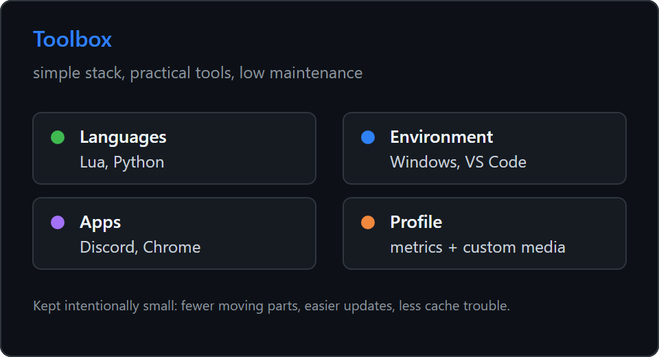

  

---

<table>
  <tr>
    <td width="50%" valign="top">
      
    </td>
    <td width="50%" valign="top">
      
    </td>
  </tr>
  <tr>
    <td width="50%" valign="top">
      
    </td>
    <td width="50%" valign="top">
      
    </td>
  </tr>
</table>

Infographics use the [lowlighter/metrics](https://github.com/lowlighter/metrics) style. Personal media and profile details are custom and matched to my own data.
