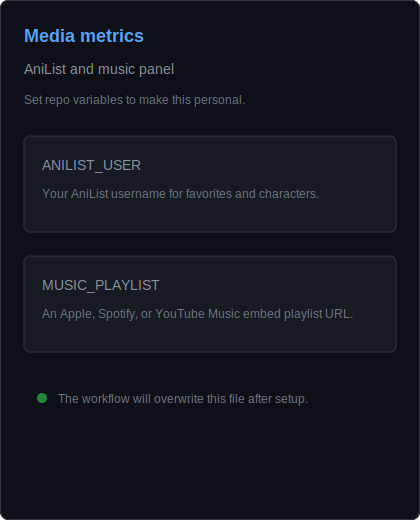

  

<table>
  <tr>
    <td width="50%" valign="top">
      
    </td>
    <td width="50%" valign="top">
      
    </td>
  </tr>
</table>

---

# My name is nc98rajsc.

I am a regular guy from Thailand who likes to create programs for fun.

Most things I make are tools that help me in my life especially for games and things I use often.

I don't really talk to people. On nights I listen to lofi music think about coding ideas play games or just sit around thinking.

I enjoy places drinking cold Coke eating simple foods like noodles and the atmosphere of late nights.

I wouldn't say I am smart or talented. I am just learning things bit, by bit. Building things that seem fun to me.

---

Tech Stack:

  

Software:

  

