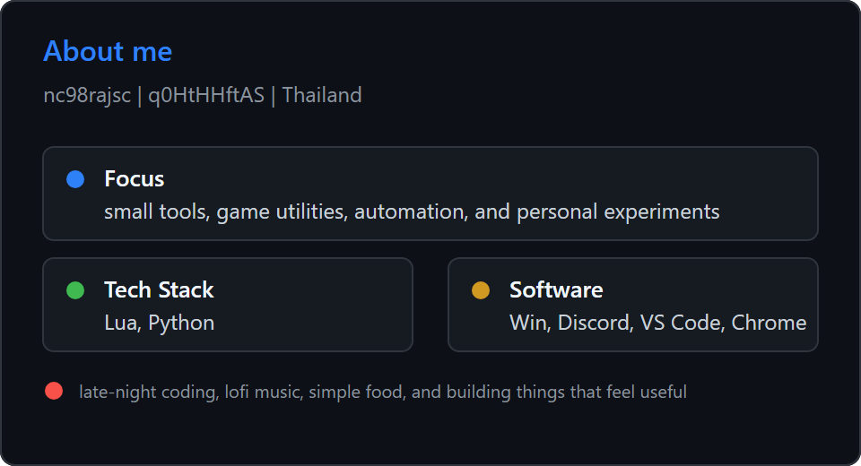

> Building small tools for games, automation, and daily workflows.\
> Thailand-based, mostly learning by making things that are useful or fun.

<table>
  <tr>
    <td width="50%" valign="top">
      
    </td>
    <td width="50%" valign="top">
      
    </td>
  </tr>
  <tr>
    <td width="50%" valign="top">
      
    </td>
    <td width="50%" valign="top">
      
    </td>
  </tr>
</table>

Infographics use the [lowlighter/metrics](https://github.com/lowlighter/metrics) style. Personal media and profile details are custom and matched to my own data.
